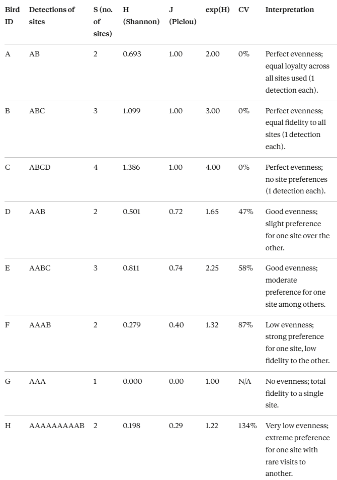

```{r setup, include=FALSE}
library(here)
source(here::here("qmd", "chapter_1", "R", "ch1_10_entropy_evenness_composition.R"))
```

::: {.callout style="border-left: 6px solid #D99B8F; --bs-callout-border: #D99B8F; padding: 1.5rem; border-radius: 8px; margin-bottom: 1rem;"}
We can describe site usage for each species alongside its individual variation — for example the [average number of sites used per species](https://themaskou.github.io/movement_ecology_shorebirds/qmd/chapter_1/ch1_2_explore.html#motus-table) and the [average rate of use per site by tide](https://themaskou.github.io/movement_ecology_shorebirds/qmd/chapter_1/ch1_7_station_usage_hours.html#resident-birds). But several questions remain: How broadly does a bird spread its detections across sites? Do conspecifics use the same sites? How much does this vary at the individual and species levels, and does tide play a role?

This page uses two complementary information-theoretic metrics to address those questions:

-   **Shannon entropy (H)** — quantifies how broadly an individual distributes its detections across Motus stations. A low-H bird concentrates its detections at few sites (narrow, predictable use); a high-H bird spreads them widely. This breadth metric serves as a widely-used **proxy/correlate** of site fidelity: a bird that always uses the same small set of sites will have low H. Strictly, *site fidelity* is a temporal concept (returning to the same sites over time), whereas H is a snapshot of the detection-proportion distribution — it indicates but does not directly measure temporal fidelity. Derived metrics: Pielou's evenness (J), effective number of sites (exp(H)), and coefficient of variation (CV) between individuals.

-   **Jensen-Shannon Divergence (JSD)** — compares site-use probability distributions between pairs of individuals. JSD ≈ 0 means two birds use sites in nearly identical proportions; JSD ≈ 1 means entirely different sites. This addresses *composition*, not breadth: two birds could both have high H yet use completely non-overlapping sites.
:::

::: blockquote-blue
**Load your data** in your R environment — see [Load & Format \> Reproducibility](https://themaskou.github.io/movement_ecology_shorebirds/qmd/chapter_1/ch1_1_load_format.html#reproducibility)
:::

::: {.callout-warning style="margin-bottom: 1rem;"}
## Limitations

Three known sources of bias apply to all results on this page:

1.  **Station uptime** — the array is assumed fully operational throughout the study period. Offline receivers are not accounted for; a bird detected at few stations may reflect absent receivers, not specialised site use.
2.  **Detection-count currency** — proportions are derived from raw Motus hit counts, which are heavily autocorrelated and confounded by residence-bout length, tag burst rate, receiver sensitivity, antenna count, and detection range. A time- or presence-based currency (e.g. detection-hours from `ch1_7_station_usage_hours.R`) is more ecologically defensible and is recommended for a future iteration.
3.  **Sampling-effort dependence** — S and H scale with total detections per individual; estimates are not rarefied. `total_detections` is reported alongside all metrics to enable assessment of this effect.
:::

```{r packages, message=FALSE, warning=FALSE, eval=FALSE, echo=TRUE}
library(motus)
library(dplyr)
library(here)
library(ggplot2)
library(tidyr)
library(readr)
library(vegan)       # adonis2, betadisper, permutest
library(philentropy)
library(gt)
library(FSA)         # dunnTest
library(patchwork)
# permute::how() is used inside the script for stratified permutations
```

## Shannon entropy

### Definition

**Shannon entropy (H)** ([Shannon & Weaver 1949](https://scholar.google.com/scholar_lookup?hl=en&publication_year=1949&journal=The+mathematical+theory+of+communication&author=C.+E.+Shannon&author=W.+Weaver&title=The+mathematical+theory+of+communication); [MacArthur 1965](https://onlinelibrary.wiley.com/doi/epdf/10.1111/j.1469-185X.1965.tb00815.x?saml_referrer); [Lou Jost 2006](https://nsojournals.onlinelibrary.wiley.com/doi/10.1111/j.2006.0030-1299.14714.x))\
***\> How broadly does an individual spread its site use?***

Shannon entropy quantifies the dispersion of an individual's site-use pattern. Applied to a bird's detection-proportion distribution across stations, it measures how **broad and unpredictable** that use is.

::: {style="overflow-x: auto; width: 100%;"}
$$
H = -\sum p_i \ln(p_i)
$$ $$
\text{where } p_i \text{ is the proportion of detections at site } i
$$
:::

-   **Low entropy (H close to 0):** Detections are concentrated at one or a few sites — narrow, predictable use. Low H is a commonly-used indicator of high site fidelity.
-   **High entropy (H \> 2):** Detections are spread across many sites roughly equally — broad, generalist use. High H indicates low apparent fidelity to any particular site.

> **Note on site fidelity.** Strict ecological site fidelity refers to the *temporal* tendency to return to the same locations over time ([Haig et al. 1998](https://www.ncbi.nlm.nih.gov/pmc/articles/PMC5586202/)). Shannon entropy of detection proportions is a *snapshot* diversity measure; it indicates the breadth/predictability of site use but does not directly capture the return structure that formally defines fidelity. A bird with very low H almost certainly has high fidelity to its few sites — but H alone cannot confirm whether those sites are the *same* across different visits.

------------------------------------------------------------------------

**Pielou's evenness (J)** [(Pielou 1966)](https://www.sciencedirect.com/science/article/abs/pii/0022519366900130)\
***\> Are the sites a bird uses visited equally?***

H increases both with the number of sites and when site use becomes more even, mixing two effects. Pielou's J rescales H by the maximum possible entropy for the same number of sites, giving a \[0, 1\] measure of evenness that is independent of how many sites are used.

::: {style="overflow-x: auto; width: 100%;"}
$$
J = \frac{H}{\ln(S)} \quad \text{where } S = \text{number of sites used by the individual}
$$
:::

-   J ≈ 1: All sites are used equally.
-   J ≈ 0: One or a few sites dominate.
-   J is undefined (NA) when S = 1.

------------------------------------------------------------------------

**Effective number of sites (exp(H))** [(MacArthur 1965)](https://onlinelibrary.wiley.com/doi/epdf/10.1111/j.1469-185X.1965.tb00815.x?saml_referrer)\
***\> How many equally-used sites does this bird's use correspond to?***

::: {style="overflow-x: auto; width: 100%;"}
$$
\text{Effective sites} = e^H
$$
:::

If H = 1.61, then exp(H) ≈ 5: the bird distributes its use as if it were split equally among 5 sites, even if it actually visits more with uneven proportions.

------------------------------------------------------------------------

**Coefficient of variation (CV_H)**\
***\> How variable are individuals within a species?***

CV_H = (SD of H / mean H) × 100, reported as a percentage. It is a **descriptive** measure of between-individual heterogeneity within a species. Because each bird yields only one H value from the full study period, within-species inferential testing is not valid here — temporal replication would be required. The boxplots and CV are used for description only.

------------------------------------------------------------------------

### Examples



------------------------------------------------------------------------

### General results

We compute H, J, exp(H), and S for each individual from full-precision detection proportions (no intermediate rounding).

```{r shannon-fn, message=FALSE, warning=FALSE, eval=FALSE, echo=TRUE}
# Shannon entropy: H = -sum(p * ln(p))
calculate_shannon <- function(proportions) {
  p <- proportions[proportions > 0]   # exclude zeros (log(0) undefined)
  H <- -sum(p * log(p))
  return(H)
}
```

```{r entropy-pipeline, message=FALSE, warning=FALSE, eval=FALSE, echo=TRUE}
entropy_results <- df.alltags %>%
  filter(!is.na(Band.ID), !is.na(recvDeployName)) %>%

  # Count detections per bird per site
  group_by(speciesEN, Band.ID, recvDeployName) %>%
  summarise(detections = n(), .groups = "drop") %>%

  # Proportions per bird (full precision — rounded only at display)
  group_by(speciesEN, Band.ID) %>%
  mutate(
    total_detections = sum(detections),
    proportion       = detections / total_detections) %>%

  # Entropy metrics per bird
  summarise(
    S                = n(),
    H                = calculate_shannon(proportion),
    J                = if_else(S == 1, NA_real_, H / log(S)),   # guard S = 1
    total_detections = first(total_detections),
    .groups          = "drop") %>%

  mutate(exp_H = exp(H)) %>%
  arrange(speciesEN, Band.ID)
```

**Species-level summary:**

```{r tbl-entropy-summary, echo=FALSE, eval=TRUE, message=FALSE, warning=FALSE}
tbl_entropy_summary
```

**Distribution of metrics across individuals:**

```{r plot-entropy-box, echo=FALSE, eval=TRUE, message=FALSE, warning=FALSE, fig.width=11, fig.height=7, out.width="100%"}
plot_entropy_box
```

**Individual-level values** (expandable):

::: {.callout-tip collapse="true" title="S — Number of Sites Used"}
```{r gt-S, echo=FALSE, message=FALSE, warning=FALSE}
gt_S
```
:::

::: {.callout-tip collapse="true" title="H — Shannon Entropy"}
```{r gt-H, echo=FALSE, message=FALSE, warning=FALSE}
gt_H
```
:::

::: {.callout-tip collapse="true" title="J — Pielou's Evenness"}
```{r gt-J, echo=FALSE, message=FALSE, warning=FALSE}
gt_J
```
:::

::: {.callout-tip collapse="true" title="exp(H) — Effective Number of Sites"}
```{r gt-expH, echo=FALSE, message=FALSE, warning=FALSE}
gt_exp_H
```
:::

------------------------------------------------------------------------

### Between-species comparison \| Kruskal-Wallis + Dunn

::: blockquote-yellow
**Note:** Only species with **≥ 3** tagged individuals are included. Individuals are valid replicates *between* species for this test. Within-species inference on H, J, S or exp(H) is not valid here — each bird produces exactly one value per metric, so there is no within-species replication; descriptive CV and boxplots serve that purpose instead.
:::

```{r kw-between-code, message=FALSE, warning=FALSE, eval=FALSE, echo=TRUE}
entropy_kw_data <- entropy_results %>%
  group_by(speciesEN) %>%
  filter(n() >= 3) %>%
  ungroup()

kw_between_species <- data.frame()
for (m in c("H", "J", "exp_H", "S")) {
  vals  <- entropy_kw_data[[m]]
  grp   <- entropy_kw_data$speciesEN
  valid <- !is.na(vals)
  n_per_sp <- tapply(vals[valid], grp[valid], length)
  if (any(n_per_sp < 2)) next

  kt <- kruskal.test(vals[valid] ~ grp[valid])
  kw_between_species <- rbind(kw_between_species, data.frame(
    Metric       = m,
    n_species    = n_distinct(grp[valid]),
    n_indiv      = sum(valid),
    Chi_sq       = round(kt$statistic, 3),
    df           = kt$parameter,
    p_value      = kt$p.value,
    Significance = case_when(
      kt$p.value < 0.001 ~ "***",
      kt$p.value < 0.01  ~ "**",
      kt$p.value < 0.05  ~ "*",
      TRUE               ~ "ns"),
    stringsAsFactors = FALSE))
}
```

```{r tbl-kw-between, echo=FALSE, eval=TRUE, message=FALSE, warning=FALSE}
tbl_kw_between
```

**Dunn post-hoc (Bonferroni)** — shown only for metrics where Kruskal-Wallis was significant (p \< 0.05):

```{r tbl-dunn-between, echo=FALSE, eval=TRUE, message=FALSE, warning=FALSE}
if (exists("tbl_dunn_between")) tbl_dunn_between
```

------------------------------------------------------------------------

### Tidal dependence \| Paired Wilcoxon signed-rank

Entropy metrics are recomputed separately for High and Low tide detections. Each bird then provides one High-tide and one Low-tide value — a natural paired design. The paired Wilcoxon signed-rank test (exact = FALSE for ties) is used to ask whether tide shifts site-use breadth within a species. Only birds with both High and Low tide observations are included; only species with ≥ 5 complete pairs are tested.

```{r entropy-tide-code, message=FALSE, warning=FALSE, eval=FALSE, echo=TRUE}
entropy_results_tide <- df.alltags %>%
  filter(!is.na(Band.ID), !is.na(recvDeployName)) %>%

  group_by(speciesEN, Band.ID, recvDeployName, tideHighLow) %>%
  summarise(detections = n(), .groups = "drop") %>%

  group_by(speciesEN, Band.ID, tideHighLow) %>%
  mutate(
    total_detections = sum(detections),
    proportion       = detections / total_detections) %>%

  summarise(
    S                = n(),
    H                = calculate_shannon(proportion),
    J                = if_else(S == 1, NA_real_, H / log(S)),
    total_detections = first(total_detections),
    .groups          = "drop") %>%

  mutate(exp_H = exp(H)) %>%
  arrange(speciesEN, Band.ID, tideHighLow)
```

**Distribution by species and tide** (High tide: solid, Low tide: transparent):

```{r plot-entropy-tide, echo=FALSE, eval=TRUE, message=FALSE, warning=FALSE, fig.width=11, fig.height=7, out.width="100%"}
plot_entropy_box_tide
```

**Species × tide summary:**

```{r tbl-entropy-tide, echo=FALSE, eval=TRUE, message=FALSE, warning=FALSE}
tbl_entropy_summary_tide
```

**Paired Wilcoxon test results:**

```{r tbl-wilcox-tide, echo=FALSE, eval=TRUE, message=FALSE, warning=FALSE}
tbl_wilcox_tide
```

------------------------------------------------------------------------

## Jensen-Shannon Divergence

### Definition

**Jensen-Shannon Divergence (JSD)** ([Lin 1991](https://ieeexplore.ieee.org/document/61115); [Takahashi et al. 2012](https://journals.plos.org/plosone/article?id=10.1371/journal.pone.0049949))\
***\> Do conspecifics use the same sites?***

Shannon entropy describes how broadly each individual uses sites. JSD addresses a different question: do individuals within the same species use *overlapping* sites? JSD compares two individuals' detection-proportion distributions:

::: {style="overflow-x: auto; width: 100%;"}
$$
\text{JSD}(P \| Q) = H(M) - \frac{H(P) + H(Q)}{2}
$$ $$
\text{where } P, Q \text{ are two individuals' site distributions; } M = \frac{P + Q}{2}; \text{ and } H \text{ is Shannon entropy}
$$
:::

-   **JSD ≈ 0** → identical site composition (conspecifics use the same sites in the same proportions).
-   **JSD ≈ 1** → completely different site composition (non-overlapping sites or proportions).

> **Why PERMANOVA, not Kruskal-Wallis?** Each pairwise JSD value involves two individuals; with *n* individuals in a species there are *n*(n-1)/2 pairs, and each individual appears in *n-1* pairs. Standard tests (KW, ANOVA) applied to pairwise values are therefore **pseudoreplicated** — the observations are not independent. PERMANOVA (adonis2) and PERMDISP (betadisper) are permutation-based and valid for distance matrices where pairwise values are inherently non-independent.

------------------------------------------------------------------------

### General results

Pairwise JSD is computed from full-precision proportions (no intermediate rounding) across all individuals, then filtered to same-species pairs for the summaries below.

```{r jsd-fn, message=FALSE, warning=FALSE, eval=FALSE, echo=TRUE}
calculate_jsd <- function(p, q) {
  epsilon <- 1e-10
  p <- p + epsilon
  q <- q + epsilon
  p <- p / sum(p)
  q <- q / sum(q)
  m   <- (p + q) / 2
  jsd <- 0.5 * sum(p * log2(p / m)) + 0.5 * sum(q * log2(q / m))
  return(jsd)
}
```

```{r jsd-pipeline, message=FALSE, warning=FALSE, eval=FALSE, echo=TRUE}
# Individual × site proportion matrix (full precision)
site_use_matrix <- df.alltags %>%
  filter(!is.na(Band.ID), !is.na(recvDeployName)) %>%
  group_by(Band.ID, recvDeployName) %>%
  summarise(detections = n(), .groups = "drop") %>%
  group_by(Band.ID) %>%
  mutate(proportion = detections / sum(detections)) %>%
  select(Band.ID, recvDeployName, proportion) %>%
  pivot_wider(names_from = recvDeployName, values_from = proportion, values_fill = 0)

# Pairwise JSD loop
individual_ids <- as.character(site_use_matrix$Band.ID)
n_individuals  <- length(individual_ids)
jsd_results    <- data.frame()

for (i in 1:(n_individuals - 1)) {
  for (j in (i + 1):n_individuals) {
    p <- as.numeric(site_use_matrix[i, -1])
    q <- as.numeric(site_use_matrix[j, -1])
    jsd_results <- rbind(jsd_results, data.frame(
      Band.ID_1  = individual_ids[i],
      Band.ID_2  = individual_ids[j],
      JSD        = round(calculate_jsd(p, q), 3),
      Similarity = round(1 - calculate_jsd(p, q), 3)))
  }
}
```

**Within-species JSD distribution:**

```{r plot-jsd-box, echo=FALSE, eval=TRUE, message=FALSE, warning=FALSE, fig.width=10, fig.height=5, out.width="100%"}
plot_jsd_box
```

**Summary by species:**

```{r tbl-jsd-summary, echo=FALSE, eval=TRUE, message=FALSE, warning=FALSE}
tbl_jsd_summary
```

------------------------------------------------------------------------

### Between-species composition \| PERMANOVA + PERMDISP

Tests whether site-use composition (as captured by JSD) differs between species (PERMANOVA), and whether within-species spread in composition differs between species (PERMDISP).

**PERMANOVA — do species centroids in JSD space differ?**

```{r tbl-permanova-species, echo=FALSE, eval=TRUE, message=FALSE, warning=FALSE}
tbl_permanova_species
```

**Pairwise PERMANOVA** (p-values BH-adjusted for multiple comparisons):

```{r tbl-pairwise-permanova, echo=FALSE, eval=TRUE, message=FALSE, warning=FALSE}
tbl_pairwise_permanova
```

**PERMDISP — do species differ in within-species compositional spread?**

```{r tbl-permdisp-species, echo=FALSE, eval=TRUE, message=FALSE, warning=FALSE}
tbl_permdisp_species
```

------------------------------------------------------------------------

### Tidal dependence \| Per-species PERMANOVA + PERMDISP

For each species, a full JSD distance matrix is computed across all individual × tide combinations, then tested with `adonis2(dist ~ tideHighLow)`. Permutations are stratified within `Band.ID` to account for the paired within-individual structure. Only species with ≥ 4 individual × tide observations and both tide levels represented are tested.

```{r jsd-tide-code, message=FALSE, warning=FALSE, eval=FALSE, echo=TRUE}
# Build individual × tide proportion matrix (species with >= 5 individuals)
site_use_matrix_tide <- df.alltags %>%
  filter(!is.na(Band.ID), !is.na(recvDeployName)) %>%
  group_by(speciesEN) %>%
  filter(n_distinct(Band.ID) >= 5) %>%
  ungroup() %>%
  group_by(Band.ID, recvDeployName, tideHighLow) %>%
  summarise(detections = n(), .groups = "drop") %>%
  group_by(Band.ID, tideHighLow) %>%
  mutate(proportion = detections / sum(detections)) %>%
  select(Band.ID, recvDeployName, tideHighLow, proportion) %>%
  pivot_wider(names_from = recvDeployName, values_from = proportion, values_fill = 0) %>%
  unite("id_tide", Band.ID, tideHighLow, remove = FALSE)

# Per-species: full JSD matrix -> adonis2 (stratified) + betadisper
for (sp in unique(site_use_tide_meta$speciesEN)) {
  # ... (see R script for full loop)
  perm_h <- permute::how(blocks = sp_meta$Band.ID, nperm = 999)
  ad_sp  <- adonis2(sp_jsd_dist ~ tideHighLow, data = sp_meta, permutations = perm_h)
  bd_sp  <- betadisper(sp_jsd_dist, group = sp_meta$tideHighLow)
}
```

**JSD within-species summary by tide:**

```{r tbl-jsd-summary-tide, echo=FALSE, eval=TRUE, message=FALSE, warning=FALSE}
tbl_jsd_summary_tide
```

**JSD distribution by species and tide** (High tide: solid, Low tide: transparent):

```{r plot-jsd-tide, echo=FALSE, eval=TRUE, message=FALSE, warning=FALSE, fig.width=10, fig.height=5, out.width="100%"}
plot_jsd_box_tide
```

**PERMANOVA — tide effect on JSD composition (per species):**

```{r tbl-jsd-permanova-tide, echo=FALSE, eval=TRUE, message=FALSE, warning=FALSE}
if (!is.null(tbl_jsd_permanova_tide)) tbl_jsd_permanova_tide else cat("*No species had sufficient data for the per-species tide PERMANOVA.*")
```

**PERMDISP — tide effect on within-group compositional spread (per species):**

```{r tbl-jsd-permdisp-tide, echo=FALSE, eval=TRUE, message=FALSE, warning=FALSE}
if (!is.null(tbl_jsd_permdisp_tide)) tbl_jsd_permdisp_tide else cat("*No species had sufficient data for the per-species tide PERMDISP.*")
```

------------------------------------------------------------------------

## Appendix — Superseded exploratory analyses {#appendix}

The four sections below were part of an earlier exploratory version of this page. They have been replaced by the analyses above because they were **statistically invalid**. The code is preserved here for reference but is **not executed**.

::: {.callout-warning collapse="true" title="A1 — Within-species Kruskal-Wallis on H / J / S (replaced by between-species KW above)"}
**What it did:** Ran a Kruskal-Wallis test *within each species* using individual Band.IDs as groups, asking whether individuals within the same species had significantly different H, J, or S values.

**Why it is invalid:** Kruskal-Wallis tests for differences *between* groups. Here there is only *one observation per group* (each Band.ID yields exactly one H value from the full study period) — a test of between-individual differences within a species requires within-individual replication (e.g. repeated measurements across time). The test reduces to a test with no within-group variance, which produces meaningless statistics.

**Replaced by:** Between-species Kruskal-Wallis (§ "Between-species comparison" above), where individuals are valid replicates within species. Within-species heterogeneity is described descriptively via CV_H and the boxplots.

```{r appendix-kw-within, eval=FALSE, echo=TRUE, message=FALSE, warning=FALSE}
kruskal_within_species <- entropy_results %>%
  group_by(speciesEN) %>%
  filter(n() >= 3) %>%
  summarise(
    n_individuals = n(),
    Chi_sq_H  = kruskal.test(H ~ Band.ID)$statistic,
    df_H      = kruskal.test(H ~ Band.ID)$parameter,
    p_value_H = kruskal.test(H ~ Band.ID)$p.value,
    Chi_sq_J  = kruskal.test(J ~ Band.ID)$statistic,
    df_J      = kruskal.test(J ~ Band.ID)$parameter,
    p_value_J = kruskal.test(J ~ Band.ID)$p.value,
    Chi_sq_S  = kruskal.test(S ~ Band.ID)$statistic,
    df_S      = kruskal.test(S ~ Band.ID)$parameter,
    p_value_S = kruskal.test(S ~ Band.ID)$p.value,
    .groups = "drop")
```
:::

::: {.callout-warning collapse="true" title="A2 — Two-way ANOVA on entropy metrics by tide (replaced by paired Wilcoxon above)"}
**What it did:** Fitted `aov(metric ~ Band.ID + tideHighLow)` per species, then checked Shapiro-Wilk and Levene assumptions and reported F-statistics for both terms.

**Why it is invalid:** ANOVA assumes normally distributed residuals and independence of observations. More critically, the tide × entropy data in this study have at most *one High-tide and one Low-tide value per bird* — the design is already perfectly paired, and the additive model inflates degrees of freedom. ANOVA here is equivalent to a dependent-samples t-test with incorrect error structure. Normality assumptions are also frequently violated (entropy values are bounded and skewed). Additionally, `stat_compare_means(method = "t.test")` was applied to the grouped boxplot, which treats paired observations as independent.

**Replaced by:** Paired Wilcoxon signed-rank test (§ "Tidal dependence \| Paired Wilcoxon" above), which is exact for this paired within-individual structure, non-parametric, and handles ties correctly.

```{r appendix-anova-entropy, eval=FALSE, echo=TRUE, message=FALSE, warning=FALSE}
# Two-way ANOVA — entropy metrics by tide (SUPERSEDED — see paired Wilcoxon above)
results     <- data.frame()
assumptions <- data.frame()

for (sp in species_list_entropy) {
  for (m in metrics_list_entropy) {
    df    <- subset(entropy_aov_data_tide, speciesEN == sp & metric == m)
    df    <- na.omit(df)
    model <- aov(value ~ Band.ID + tideHighLow, data = df)
    s     <- summary(model)[[1]]
    # ... (results and assumption extraction omitted for brevity)
  }
}
```
:::

::: {.callout-warning collapse="true" title="A3 — Kruskal-Wallis + Dunn on pairwise JSD values (replaced by PERMANOVA above)"}
**What it did:** Applied `kruskal.test(JSD ~ species_1)` directly to the data frame of pairwise JSD values (one row per pair), then ran `dunnTest` for pairwise species comparisons.

**Why it is invalid:** Each individual contributes to *n-1* pairs. With *n* individuals in a species, the *n*(n-1)/2 pairwise JSD values are **not independent**. KW/Dunn treat them as independent observations, massively inflating effective sample size and making all p-values meaningless (pseudoreplication). This is the same issue that makes ANOVA on pairwise distances invalid.

**Replaced by:** PERMANOVA (adonis2) and pairwise PERMANOVA on the full JSD distance matrix (§ "Between-species composition" above), which use permutation-based inference that is valid for non-independent distance data.

```{r appendix-kw-jsd, eval=FALSE, echo=TRUE, message=FALSE, warning=FALSE}
# Kruskal-Wallis on pairwise JSD — SUPERSEDED — pseudoreplicated (see PERMANOVA above)
kruskal_value <- kruskal.test(JSD ~ species_1,
                              data = jsd_results %>% filter(same_species == TRUE))

if (kruskal_value$p.value < 0.05) {
  dunn_jsd <- dunnTest(JSD ~ species_1,
                       data   = jsd_results %>% filter(same_species == TRUE),
                       method = "bonferroni")
}
```
:::

::: {.callout-warning collapse="true" title="A4 — Two-way ANOVA on pairwise JSD by tide (replaced by per-species PERMANOVA/PERMDISP above)"}
**What it did:** For each species, computed within-tide pairwise JSD values then fitted `aov(JSD ~ Band.ID_1 + tideHighLow)` using `Band.ID_1` as a grouping factor, along with extensive assumption checking (Shapiro-Wilk, Levene, residual diagnostic plots in tabset panels).

**Why it is invalid:** All the pseudoreplication problems from A3 apply here — pairwise JSD values are non-independent observations. Additionally, using `Band.ID_1` as a covariate in ANOVA on pairwise distances does not correctly account for the paired within-individual structure; it conflates individual identity with a block effect in a way ANOVA cannot handle. Assumption violations (non-normality, heteroscedasticity) were also frequent.

**Replaced by:** Per-species PERMANOVA with permutations stratified within `Band.ID` (§ "Tidal dependence \| Per-species PERMANOVA + PERMDISP" above), which correctly handles both the non-independence of pairwise distances and the paired individual structure.

```{r appendix-anova-jsd, eval=FALSE, echo=TRUE, message=FALSE, warning=FALSE}
# Two-way ANOVA on JSD by tide — SUPERSEDED — pseudoreplicated (see per-species PERMANOVA above)
results_jsd_tide <- data.frame()
assumptions_jsd  <- data.frame()

for (sp in species_list_jsd) {
  df <- subset(jsd_for_plot_tide, species_1 == sp & metric == "JSD")
  df <- na.omit(df)
  df$Band.ID_1   <- droplevels(df$Band.ID_1)
  df$tideHighLow <- droplevels(df$tideHighLow)

  model <- aov(value ~ Band.ID_1 + tideHighLow, data = df)
  # ... (assumption checks and result extraction omitted for brevity)
}
```
:::
