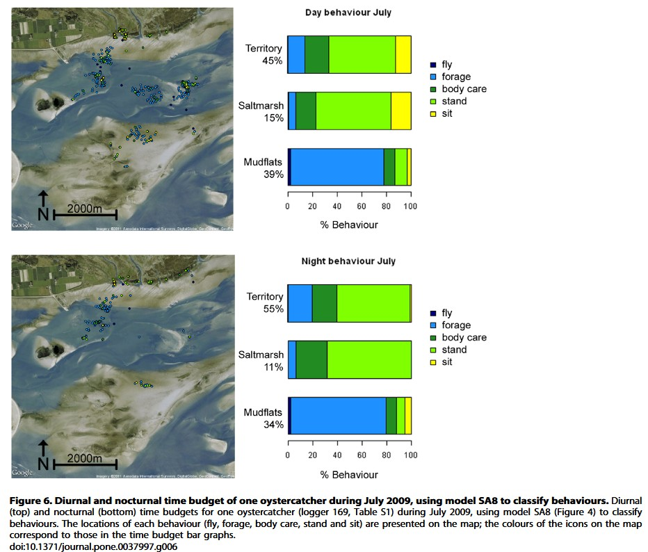
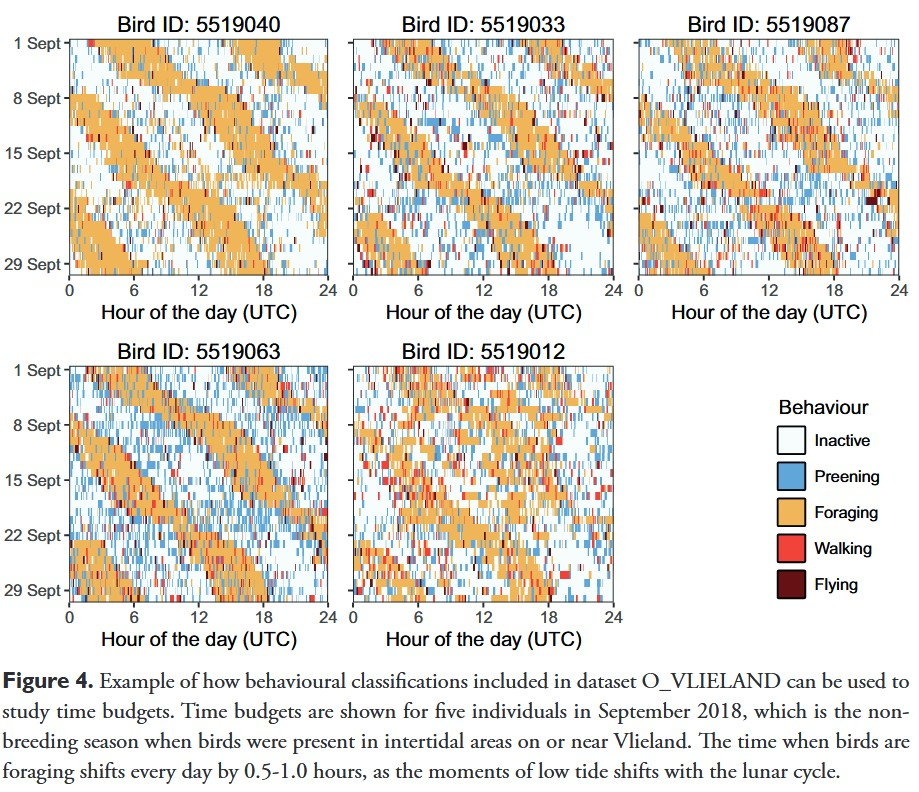

::: {.callout style="border-left: 6px solid #D99B8F; --bs-callout-border: #D99B8F; padding: 1.5rem; border-radius: 8px; margin-bottom: 1rem;"}
**TO BE IMPROVED - This is preliminary analysis**

This page aims to define the priors required to estimate the number of individuals we need to trap, equip with GPS/accelerometer devices, so we can reliably answer our scientific question. The priors are mainly defined by the size sample.\
Indeed, the sampling duration will depend on the question (i.e., comparing different periods) and is acknowledged for a minimum of 100 min per individuals; and the sampling interval is set as constant across individual and based by on the literature (i.e., 25 Hz).
:::

# Defining research targets

We aim to assess what behavior a bird hold at a site.

**Several questions are defined:**

\(i\) classify behavior per individual across two or more species of shorebirds

\(ii\) assess the Intraclass Correlation Coefficient (ICC) between different species: how similar the birds are in term of behavior time budget?

\(iii\) assess the average proportion of behavior held per species and per sites

\(iv\) compare and test whether shorebirds use different sites to either forage or roost depending the tide and the time

# Selecting existing data

Now we established our research targets, the next step is to select the appropriate datasets to extract individual behavior data. So we can simulate a synthetic case that we will use to assess our sample features requirement to design at the best the method we will implement on the ground in the real world.

We extracted results from accelerometer data set from Oyster catchers [Shamoun-Baranaes et al. 2012](https://journals.plos.org/plosone/article?id=10.1371/journal.pone.0037997).

::: blockquote-red
**Load the data** in your R environment:

[***Oyster catchers***]{.underline}

Accessible on Movebank with accelerometry available (consulted on 07 April 2026):

-   *van der Kolk H-J, Desmet P, Oosterbeek K, Allen AM, Baptist MJ, Bom RA, Davidson SC, de Jong J, de Kroon H, Dijkstra B, Dillerop R, Dokter AM, Frauendorf M, Milotić T, Rakhimberdiev E, Shamoun-Baranes J, Spanoghe G, van de Pol M, Van Ryckegem G, Vanoverbeke J, Jongejans E, Ens BJ (2022) GPS tracking data of Eurasian oystercatchers (Haematopus ostralegus) from the Netherlands and Belgium. ZooKeys 1123: 31-45. https://doi.org/10.3897/zookeys.1123.90623*

Data available from [Peter Desmet et al. - 2021](https://www.movebank.org/cms/webapp?gwt_fragment=page=studies,path=study1605798640).
:::

::: blockquote-blue
***Other potential data***

Accessible on Movebank but without accelerometry available yet (consulted on 07 April 2026):

[*Godwits - GPS devices used - No accelerometer data available*]{.underline}

-   *CHAMPAGNON, J., COURBIN N., DUFOUR P., TILLO S., DENOUAL L., GREMILLET D., JIGUET F., DURIEZ O. 2025. MIGRALION - Caractérisation de l’utilisation du golfe du lion par les migrateurs terrestres et l’avifaune marine à l’aide de méthodes complémentaires : Rapport final d’analyses du Lot 3 « Télémétrie, migrateurs terrestres et oiseaux marins ». Rapport pour l’OFB. 149 PP. https://www.eoliennesenmer.fr/migralion-lot-3*

Data available from [Jiguet Frederic et al. - 2025](https://www.movebank.org/cms/webapp?gwt_fragment=page=studies,path=study533575900).

[*Plovers - Argos devices used - No accelerometer data available*]{.underline}

-   *Exo K, Hillig F, Bairlein F. 2019. Data from: Migration routes and strategies of Grey Plovers (Pluvialis squatarola) on the East Atlantic Flyway as revealed by satellite tracking. Movebank Data Repository. https://doi.org/10.5441/001/1.vv0ft02m*

Data available from [Klaus-Michael Exo et al. - 2019](https://www.movebank.org/cms/webapp?gwt_fragment=page=studies,path=study533575900).

[*Curlew and Whimbrel - GPS devices used - No accelerometer data available*]{.underline}
:::

# Packages

```{r packages,  message = FALSE, warning = FALSE, eval = TRUE, echo = TRUE}
library(tidyverse)
library(lme4)
library(ggplot2)
library(patchwork)

```

# Setting variances

**Proportions of behaviors are extracted from these results below.**

::: {style="display: flex; align-items: center; justify-content: center; min-height: 60vh;"}
<figure style="text-align: center; max-width: 950px; width: 90%; margin: 0 auto;">



</figure>
:::

**Variance between individuals in behavior proportions are extracted from these results below.**

::: {style="display: flex; align-items: center; justify-content: center; min-height: 60vh;"}
<figure style="text-align: center; max-width: 950px; width: 90%; margin: 0 auto;">



</figure>
:::

```{r load data,  message = FALSE, warning = FALSE, eval = TRUE, echo = TRUE}

# True population mean behavioural budgets (must sum to 1)
true_means <- c(
  long_fly  = 0.03,  
  forage    = 0.35,   
  roost     = 0.57,   
  short_fly = 0.05   
)
 
# Between-individual SD on logit scale (reflects real biological variation)
between_ind_sd <- c(
  long_fly  = 0.21,  
  forage    = 0.32,  
  roost     = 0.32,   
  short_fly = 0.19    
)
 
# Within-individual SD (measurement noise per observation window)
within_ind_sd <- c(
  long_fly  = 0.40,
  forage    = 0.28,
  roost     = 0.22,
  short_fly = 0.38)
 
# Number of observation windows per individual (e.g., hourly segments)
n_obs_per_bird <- 96  # 30-min windows over ~2 days continuous recording
 
# Simulation parameters
n_sims       <- 500   # permutations per N
sample_sizes <- c(5, 10, 15, 20, 25, 30)
behaviours   <- names(true_means)

```

# Helpers

```{r biais incorpo,  message = FALSE, warning = FALSE, eval = TRUE, echo = TRUE}

logit    <- function(p) log(p / (1 - p))
inv_logit <- function(x) 1 / (1 + exp(-x))

```

# Simulating sampling design

```{r power analysis,  message = FALSE, warning = FALSE, eval = TRUE, echo = TRUE}

simulate_dataset <- function(n_birds, behaviour) {
  mu    <- logit(true_means[behaviour])
  b_sd  <- between_ind_sd[behaviour]
  w_sd  <- within_ind_sd[behaviour]
 
  # Individual-level random intercepts
  bird_effects <- rnorm(n_birds, 0, b_sd)
 
  # Observation-level proportions
  obs <- map_dfr(1:n_birds, function(i) {
    raw <- rnorm(n_obs_per_bird, mu + bird_effects[i], w_sd)
    tibble(
      bird_id  = i,
      prop     = inv_logit(raw)
    )
  })
  obs
}

```

```{r power analysis parameters,  message = FALSE, warning = FALSE, eval = TRUE, echo = TRUE}

get_ci_width <- function(n_birds, behaviour) {
  dat <- simulate_dataset(n_birds, behaviour)
 
  # Bird-level mean (the natural unit for a behavioural budget)
  bird_means <- dat %>%
    group_by(bird_id) %>%
    summarise(mean_prop = mean(prop), .groups = "drop")
 
  # 95% CI via t-distribution
  n   <- nrow(bird_means)
  m   <- mean(bird_means$mean_prop)
  se  <- sd(bird_means$mean_prop) / sqrt(n)
  ci_width <- 2 * qt(0.975, df = n - 1) * se
 
  tibble(
    n_birds   = n_birds,
    behaviour = behaviour,
    mean_est  = m,
    ci_width  = ci_width,
    ci_pct    = ci_width * 100   # as percentage points
  )
}


```

```{r simulation,  message = FALSE, warning = FALSE, eval = TRUE, echo = TRUE}
message("Running simulations — this may take ~30 seconds...")
 
results <- expand_grid(
  sim       = 1:n_sims,
  n_birds   = sample_sizes,
  behaviour = behaviours
) %>%
  pmap_dfr(function(sim, n_birds, behaviour) {
    get_ci_width(n_birds, behaviour)
  })
 
# Summarise across simulations
summary_df <- results %>%
  group_by(n_birds, behaviour) %>%
  summarise(
    mean_ci_pct   = mean(ci_pct),
    sd_ci_pct     = sd(ci_pct),
    lo95          = quantile(ci_pct, 0.025),
    hi95          = quantile(ci_pct, 0.975),
    .groups       = "drop"
  )
 
message("Simulations complete.")
 


```

```{r load,  message = FALSE, warning = FALSE, eval = TRUE, echo = TRUE}

# Uses the LARGEST sample (30 birds) as ground truth
# Subsamples 1..30 and tracks how the estimated mean converges
 
message("Running accumulation curves...")

 
n_max   <- 30
n_raref <- 200  # permutations per step
 
accumulation <- expand_grid(
  sim       = 1:n_raref,
  n_sub     = 1:n_max,
  behaviour = behaviours
) %>%
  pmap_dfr(function(sim, n_sub, behaviour) {
    dat <- simulate_dataset(n_max, behaviour)
    selected_birds <- sample(unique(dat$bird_id), n_sub)
    sub <- dat %>% filter(bird_id %in% selected_birds)
    tibble(
      sim       = sim,
      n_sub     = n_sub,
      behaviour = behaviour,
      mean_prop = mean(sub$prop)
    )
  })
 
accum_summary <- accumulation %>%
  group_by(n_sub, behaviour) %>%
  summarise(
    mean_est = mean(mean_prop),
    sd_est   = sd(mean_prop),
    lo       = quantile(mean_prop, 0.025),
    hi       = quantile(mean_prop, 0.975),
    .groups  = "drop"
  ) %>%
  mutate(behaviour = factor(behaviour,
    levels = c("forage", "roost", "short_fly", "long_fly"),
    labels = c("Foraging", "Roosting", "Short Flight", "Long Flight")))


```

```{r plot results,  message = FALSE, warning = FALSE, eval = TRUE, echo = TRUE}

behaviour_colours <- c(
  "Foraging"     = "#E76F51",
  "Roosting"     = "#457B9D",
  "Short Flight" = "#2A9D8F",
  "Long Flight"  = "#E9C46A"
)
 
summary_df <- summary_df %>%
  mutate(behaviour = factor(behaviour,
    levels = c("forage", "roost", "short_fly", "long_fly"),
    labels = c("Foraging", "Roosting", "Short Flight", "Long Flight")))
 
# ── Plot 1: CI width as % vs N (main answer) ─────────────────
ggplot(summary_df, aes(x = n_birds, y = mean_ci_pct, colour = behaviour, fill = behaviour)) +
  geom_ribbon(aes(ymin = lo95, ymax = hi95), alpha = 0.12, colour = NA) +
  geom_line(linewidth = 1.2) +
  geom_point(size = 3) +
  geom_hline(yintercept = 10, linetype = "dashed", colour = "grey40", linewidth = 0.7) +
  annotate("text", x = 30.5, y = 10.5, label = "10% threshold", hjust = 1,
           size = 3.2, colour = "grey40") +
  scale_colour_manual(values = behaviour_colours) +
  scale_fill_manual(values = behaviour_colours) +
  scale_x_continuous(breaks = sample_sizes) +
  scale_y_continuous(labels = scales::label_percent(scale = 1),
                     limits = c(0, NA)) +
  labs(
    title    = "95% CI Width as a Function of Sample Size",
    subtitle = "Shaded band = 95% simulation interval across 500 permutations",
    x        = "Number of tracked individuals",
    y        = "95% CI width (percentage points)",
    colour   = "Behaviour",
    fill     = "Behaviour"
  ) +
  theme_minimal(base_size = 13) +
  theme(
    legend.position  = "bottom",
    panel.grid.minor = element_blank(),
    plot.title       = element_text(face = "bold")
  )
 
# ── Plot 2: Accumulation / stability curve ────────────────────
ggplot(accum_summary, aes(x = n_sub, y = mean_est * 100,
                                 colour = behaviour, fill = behaviour)) +
  geom_ribbon(aes(ymin = lo * 100, ymax = hi * 100), alpha = 0.12, colour = NA) +
  geom_line(linewidth = 1.1) +
  geom_hline(data = tibble(
    behaviour = factor(c("Foraging", "Roosting", "Short Flight", "Long Flight")),
    true_val  = c(40, 38, 12, 10)),
    aes(yintercept = true_val, colour = behaviour),
    linetype = "dotted", linewidth = 0.8) +
  scale_colour_manual(values = behaviour_colours) +
  scale_fill_manual(values = behaviour_colours) +
  scale_x_continuous(breaks = seq(0, 30, 5)) +
  scale_y_continuous(labels = scales::label_percent(scale = 1)) +
  facet_wrap(~behaviour, scales = "free_y") +
  labs(
    title    = "Behavioural Budget Accumulation Curve",
    subtitle = "Dotted line = true population mean. Shaded = 95% interval of subsampled estimates.",
    x        = "Number of tracked individuals",
    y        = "Estimated time budget (%)",
    colour   = "Behaviour",
    fill     = "Behaviour"
  ) +
  theme_minimal(base_size = 12) +
  theme(
    legend.position  = "none",
    panel.grid.minor = element_blank(),
    strip.text       = element_text(face = "bold"),
    plot.title       = element_text(face = "bold")
  )


```

```{r SIM results,  message = FALSE, warning = FALSE, eval = TRUE, echo = TRUE}
summary_df %>%
  select(behaviour, n_birds, mean_ci_pct) %>%
  pivot_wider(names_from = n_birds, values_from = mean_ci_pct,
              names_prefix = "N=") %>%
  print()

```
