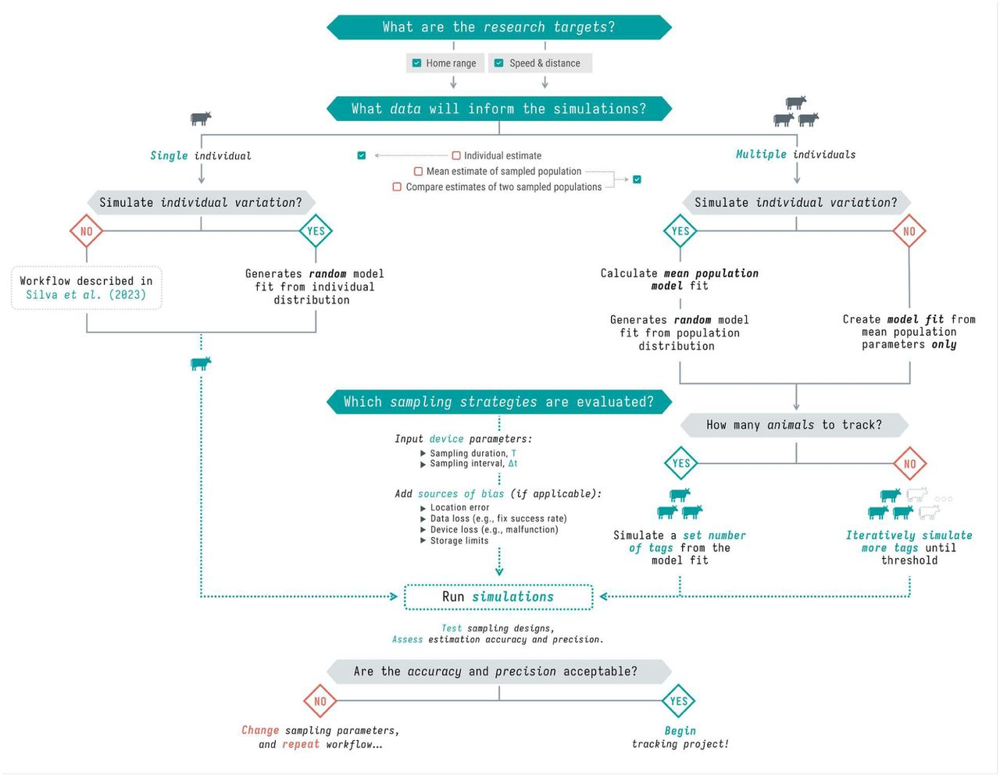

::: {.callout style="border-left: 6px solid #D99B8F; --bs-callout-border: #D99B8F; padding: 1.5rem; border-radius: 8px; margin-bottom: 1rem;"}
This page aims to define the priors required to estimate the number of individuals we need to trap, equip with GPS collars and track, so we can reliably answer our scientific question. The priors are defined by the size sample, the sampling duration and the sampling interval.

We carefully followed the methodology exposed by [Silva et al. (2025)](https://www.biorxiv.org/content/10.1101/2025.07.30.667390v1).
:::

::: {style="display: flex; align-items: center; justify-content: center; min-height: 60vh;"}
<figure style="text-align: center; max-width: 950px; width: 90%; margin: 0 auto;">



<figcaption style="margin-top: 1em; font-style: italic;">

Figure: Workflow for evaluating population sample sizes while balancing trade-offs with sampling parameters (Porteus et al. - 2023).

</figcaption>

</figure>
:::

# Defining research targets

We aim to assess the potential impact of invasive predators (European red foxes, Ferral cat) on Australian shorebirds, whether they are overlapping their home ranges in time and space.

Several questions are defined:

\(i\) assess space-use of European red foxes and Feral cats depending tidal and circadian cycles in the local estuaries

\(ii\) assess space-use of shorebirds depending tidal and circadian cycles in the local estuaries

\(iii\) compare and test whether shorebird and invasive predators space-use overlap in space and time

# Selecting existing data

Now we established our research targets, the next step is to select the appropriate datasets to extract individual- and population-level parameters. So we can simulate a synthetic case that we will use to assess our sample features requirement to design at the best the method we will implement on the ground in the real world.

We selected a data set available and open access, acquired on European red foxes (*Vulpes vulpes*) into the United Kingdom within wetlands and near peri-urban areas. This is very close to our study case since our foxes would be evolving in habitats near located around the estuaries, across wetlands and also bordered by urban areas.

::: blockquote-red
**Load the data** in your R environment accessible on movebank:

-   *Porteus TA, Short MJ, Hoodless AN, Reynolds JC. 2024. Data from: Study "Red Fox (Vulpes vulpes) in UK wet grasslands". Movebank Data Repository. [https://doi.org/10.5441/001/1.304](https://datarepository.movebank.org/entities/datapackage/86f58f48-90be-4241-b895-6af3e7952dde)*

    From the study [Porteus et al. 2024](https://link.springer.com/article/10.1007/s10344-023-01759-y).
:::

# Packages

```{r packages,  message = FALSE, warning = FALSE, eval = TRUE, echo = TRUE}
library(here) 
library(amt) 
library(sf)
library(lubridate)
library(ggplot2)
library(dplyr)
library(suncalc)
library(amt)
library(ctmm)

# devtools::install_github("pratikunterwegs/atlastools")
library(atlastools)

```

# Formatting data

Let's open, format and have a quick look on the data before all.

```{r load data,  message = FALSE, warning = FALSE, eval = TRUE, echo = TRUE}

data_csv <- read.csv(here::here("qmd", "chapter_5", "data", "fox_uk_test.csv")) 

data_all <- data_csv %>%
  mutate(timestamp = ymd_hms(timestamp)) %>%
  make_track("utm.easting", 
             "utm.northing", 
             timestamp,
             individual.local.identifier, # keep indiv.ID
             gps.hdop, # keep location error metric (horizontal dilution-of-precision)
             crs = 32630)  # EPSG for UTM zone 30N

# Quick plot 
ggplot(data_all, aes(x_, 
                 y_, 
                 color = individual.local.identifier)) +
  geom_point() +
  theme_minimal()
```

# Filtering outliers

([Gupte et al. - 2021](https://besjournals.onlinelibrary.wiley.com/doi/full/10.1111/1365-2656.13610) & [documentation](https://pratikunterwegs.github.io/atlastools/); [Jonsen et al. - 2023](https://ianjonsen.github.io/aniMotum/)).

We also filter individuals to keep only 5 so the analysis doesn't take too long to run.

```{r oultlier,  message = FALSE, warning = FALSE, eval = TRUE, echo = TRUE}

# Extract movement parameters
data_all <- data_all %>%
  mutate(
    speed_in = atl_get_speed(., 
                             x = "x_", 
                             y = "y_", 
                             time = "t_", 
                             type = "in"),
    speed_out = atl_get_speed(., 
                             x = "x_", 
                             y = "y_", 
                             time = "t_", 
                             type = "out"),
    angle = atl_turning_angle(., 
                             x = "x_", 
                             y = "y_", 
                             time = "t_")   )

# Filter unrealistic movement
# Adjust S (= 10) based on Porteus & al. (2023) findings
data <- data_all %>%
  dplyr::filter(speed_in < 10 | speed_out < 10)

# Median smoothing
# I choose to not doing it because I want keep real observed values and not compute somoothed ones

# Thinning movement tracks
# No need here but might be in real analysis

# Keep only 5 individuals to save time in procedures
data <- data %>%
  filter(individual.local.identifier %in% 
           unique(data_all$individual.local.identifier)[1:5])

```

# Verifying residency assumption

[Fleming et al. - 2014](https://www.journals.uchicago.edu/doi/full/10.1086/675504?casa_token=yTa5MK3mgdwAAAAA%3AF0MriH4Gi2aBLjU2waLAC2C1LF2e_4yRBnOA_RPr0_SXdagBvwLBt1jIqu_oY2aOuGldEaU9MrQ#_i27) [Calabrese et al. - 2016](https://besjournals.onlinelibrary.wiley.com/doi/full/10.1111/2041-210X.12559)

We must be sure **every single** tracked individuals are residential and no vagrant, so we can assess a home range.

An easy way to do this is to plot a variogram, essentially a means of visualizing time-lag-dependent behaviors in the data and thus informative to look at.

For example, with the available data (5 individuals only are checked to save time in the process), when the below figure shows a plateau, it indicates range residency, otherwise the individual is non-stationary (i.e., B16M02).

```{r residency,  message = FALSE, warning = FALSE, eval = TRUE, echo = TRUE}

# Format for ctmm
data_ctmm <- data %>%
  rename(
    x = x_,
    y = y_,
    timestamp = t_,
    individual.local.identifier = individual.local.identifier) %>%
  as.data.frame()

data_ctmm <- as.telemetry(data_ctmm,
                    projection = "+proj=utm +zone=30 +datum=WGS84")

# Split by individual
individuals <- unique(data$individual.local.identifier)

# Loop over individuals (AI generated)
results <- list()

for (id in individuals) {
  
  cat("Processing:", id, "\n")
  
  # Subset telemetry for this individual
  data_ctmm_indiv <- data_ctmm[[id]]
  
  # Plot variogram to visually inspect range residency
  vg <- variogram(data_ctmm_indiv)
  plot(vg, main = id)
  
  # Fit candidate models
  GUESS <- ctmm.guess(data_ctmm_indiv, interactive = FALSE)
  
  fits <- ctmm.select(data_ctmm_indiv, GUESS, verbose = TRUE)
  
  results[[id]] <- fits
  
}


```

Beyond visually validating the residency assumption, we can infer the data with movement model selections to verify the assumption:

-   IID (Independent and Identically Distributed) — The simplest model, assuming all locations are independent with no temporal autocorrelation. Essentially treats the animal as if it teleports randomly within its range. If this is the best model, your sampling rate is too coarse to detect any movement autocorrelation.

-   BM (Brownian Motion) — The animal diffuses randomly with no tendency to return to any area. Non-stationary, meaning the animal has no home range — it just keeps wandering indefinitely. A red flag for home range estimation.

-   OU (Ornstein-Uhlenbeck) — Adds a central tendency (home range attraction) to Brownian motion. The animal wanders but is pulled back toward a center, producing a stable home range. Positions are auto-correlated but velocities are not — meaning the model assumes instantaneous direction changes, which is biologically unrealistic at fine sampling scales.

-   OUF (Ornstein-Uhlenbeck with Foraging/velocity) — Extends OU by also auto-correlating velocities, meaning the animal moves in a more continuous, realistic trajectory with persistent direction before eventually returning to its range center. The most biologically realistic model for GPS data collected at fine temporal resolution. τF captures the timescale of this velocity autocorrelation (roughly the foraging or transit timescale), while τH captures the home range timescale.

-   OUf (Ornstein-Uhlenbeck with fine-scale autocorrelation) — Similar to OUF but with a different parameterisation of the velocity process, capturing very fine-scale movement persistence. When this model wins, it often suggests the sampling interval is very short relative to the animal's movement timescales.

-   Anisotropic variants — Any of the above models can be anisotropic, meaning the home range or movement is not assumed to be circular but can be elliptical, capturing directional biases in space use such as a range stretched along a valley or coastline.

For example, in the below results, with the available data (5 individuals only are checked to save time in the process), all five individuals are range-resident with OUF or OUf model selected. Only B16F01 is ambiguous with AIC \< 1 for several models. But M1603 which was visually not indicating a plateau is indicated here as a resident.

**Depending on our knowledge related to the species and its system, we might subjectively filter individuals.**

```{r residency 2,  message = FALSE, warning = FALSE, eval = FALSE, echo = TRUE}

# Extract best fit model per individuals
best_fits <- lapply(results, function(f) f[[1]])  

# Check best model for each individual
for (id in individuals) {
  cat("\n--- Individual:", id, "---\n")
  print(summary(results[[id]]))
}

```

**Reminder for the output values:**

**ΔAICc** — Difference in AICc (corrected Akaike Information Criterion) relative to the best model. Values below 2 indicate models with comparable support, values above 7 indicate poor support. Always interpreted relatively — the model with ΔAICc = 0 is the best supported.

**ΔRMSPE (m)** — Difference in Root Mean Square Prediction Error in meters. Measures how well the model predicts withheld locations — a cross-validation metric. The model with ΔRMSPE = 0 has the best predictive accuracy. Note that the best AICc model and best RMSPE model don't always agree, as AICc rewards parsimony while RMSPE rewards predictive fit.

**DOF\[area\]** — Degrees of freedom for the area estimate, roughly interpretable as the effective number of independent observations contributing to the home range estimate. Higher values mean a more reliable, better-constrained home range estimate. Very low values (e.g. \< 5) suggest the home range estimate should be interpreted cautiously.

```{r residency 3,  message = FALSE, warning = FALSE, eval = FALSE, echo = TRUE}

# Filter individuals which are non residents
data <- data %>%
  dplyr::filter( !individual.local.identifier %in% c("B16M02"))

best_fits <- best_fits[!grepl("B16M02", names(best_fits))]

```

# Segmenting periods

Given our assumption of a stationary movement process (e.g., its statistical properties are constant in time), it may also be necessary to segment the dataset, by time or behavioral states, prior to parameter extraction.\
Neglecting to address these issues 198 may result in parameter estimates drawn from an unrepresentative sample, undermining the reliability of downstream analyses.

Here, we will simply segment per day and night, acknowledged as the main drivers of fox behavior and movements.

```{r segment,  message = FALSE, warning = FALSE, eval = FALSE, echo = TRUE}


# Add lat/lon to data (requirement for solar time)
coords_latlon <- data %>%
  st_as_sf(coords = c("x_", "y_"), crs = 32630) %>%
  st_transform(crs = 4326) %>%
  st_coordinates() %>%
  as.data.frame() %>%
  rename(lon = X, lat = Y)
data <- data %>%
  mutate(lon = coords_latlon$lon,
         lat = coords_latlon$lat)

# Get sunrise and sunset for each unique date and location
data_filtered <- data %>%
  mutate(date = as.Date(t_)) %>%
  rowwise() %>%
  mutate(
    sun = list(getSunlightTimes(date = date,
                                lat = lat,
                                lon = lon,
                                keep = c("sunrise", "sunset"),
                                tz = "UTC")),
    sunrise = sun$sunrise,
    sunset  = sun$sunset,
    
# Distinguish nocturnal and diurnal groups
    diel = ifelse(t_ >= sunrise & t_ <= sunset, 
                  "diurnal", 
                  "nocturnal")  ) %>%
  ungroup() %>%
  select(-sun)  # remove list column

```

# Extracting pilot parameters

```{r parameters,  message = FALSE, warning = FALSE, eval = FALSE, echo = TRUE}

tau_position <- median(sapply(best_fits, function(m) {
  if(length(m) >= 13 && !is.null(m[[13]])) {
    m[[13]]["tau position", "tau position"]  
  } else NA
}), na.rm = TRUE)

tau_velocity <- median(sapply(best_fits, function(m) {
  if(length(m) >= 13 && !is.null(m[[13]])) {
    m[[13]]["tau velocity", "tau velocity"]
  } else NA
}), na.rm = TRUE)

sigma <- median(sapply(best_fits, function(m) {
  if(length(m) >= 5 && class(m[[5]]) == "covm") {
    mean(diag(m[[5]]@par))  
  } else NA
}), na.rm = TRUE)

```

# Specifying sampling parameters (duration and interval)

After defining study objectives and movement parameters, researchers select sampling models (duration and interval) to test through simulations. These simulations can incorporate real-world sources of bias, including:

-   **Location error** – inaccuracies in recorded positions, critically affecting distance and speed estimation.

-   **Data loss** – missing locations due to low fix-success rates or temporary signal issues.

-   **Deployment disruption** – premature recording stoppage caused by device malfunction, failures or animal mortality.

-   **Storage limits** – finite memory capacity of GPS units leading to incomplete datasets.

Location error is particularly important to address because, if it exceeds the true movement scale, it causes distance and speed estimates to inflate as sampling frequency increases.

::: blockquote-blue
**USE THE APP**

From here, we can use the [movedesign app](https://ecoisilva.github.io/movedesign/articles/movedesign.html) developed by Ines Silva:

-   *Silva, I., Fleming, C. H., Noonan, M. J., Fagan, W. F., & Calabrese, J. M. (2023). Movedesign: Shiny r app to evaluate sampling design for animal movement studies. Methods in Ecology and Evolution, 14(9), 2216–2225*. <https://doi.org/10.1111/2041-210X.14153>

See also *ctmm* web application [here](https://github.com/ctmm-initiative/ctmmweb?tab=readme-ov-file).
:::

```{r biais incorpo,  message = FALSE, warning = FALSE, eval = FALSE, echo = TRUE}

# Meet app requirements
data_filtered <- data_filtered %>%
  
  # rename(animal_ID = individual.local.identifier) %>%
  
  select(animal_ID, t_, x_, y_,
         # speed_in, speed_out, angle,
         diel, gps.hdop) %>% 
  
  mutate(animal_ID = as.factor(animal_ID), 
         diel= as.factor(diel) ) %>%
  
  group_by(animal_ID) %>%
  slice_sample(n = 1000, replace = FALSE) %>%  
  ungroup()

# Save and load in the app the filtered/segmented dataset
readr::write_csv(data_filtered, 
          here::here("qmd", "chapter_5", "data", "fox_uk_test_filtered.csv"))


```

```{r run app,  message = FALSE, warning = FALSE, eval = FALSE, echo = TRUE}

remotes::install_github("ecoisilva/movedesign", dependencies = TRUE) 
library(movedesign)

movedesign::run_app()

```

::: blockquote-blue
**ALTERNATIVE**

If you want to control each step or if the app doesn't work, find here below a simplified workflow to implement the same ultimate results: **how many devices should I deploy on the ground to run a robust and accurate home range analysis?**
:::

```{r set params,  message = FALSE, warning = FALSE, eval = TRUE, echo = TRUE}

species        <- "Vulpes vulpes"
sampling_int   <- 15          # minutes between fixes
fix_success    <- 0.75        # 75% fix success rate
deployment_dur <- 12          # months (battery life)
loc_error      <- 5           # meters (GPS accuracy)
storage_limit  <- 1900000     # number of fixes storage limit
dropout_rate   <- 0.15        # 15% deployment disruption

# Effective fixes per individual after accounting for fix success and dropout
fixes_per_day   <- (60 / sampling_int) * 24 * fix_success
effective_days  <- (deployment_dur * 30.4) * (1 - dropout_rate)
total_fixes     <- fixes_per_day * effective_days

```

Associated to the existing data and regarding the parameters specified, there is `r round(total_fixes)` effective fixes per individual after accounting for success of fixes collection and failure in devices. Providing `r total_fixes` observations out of `r storage_limit`.

# Simulating sampling design

```{r power analysis,  message = FALSE, warning = FALSE, eval = FALSE, echo = TRUE}

# Build population mean model from pilot parameters
mean_model <- ctmm(
  tau      = c(tau_position, tau_velocity),
  sigma    = sigma,
  isotropic = TRUE)
```

```{r power analysis parameters,  message = FALSE, warning = FALSE, eval = TRUE, echo = TRUE}

# Time sequence based on design
dt    <- sampling_int * 60          # seconds
t_seq <- seq(0, round(total_fixes) * dt, 
             by = dt)

n_range   <- c(2, 4, 6, 10, 15, 20)
n_sims    <- 5    
target_cv <- 0.25  

```

```{r simulation,  message = FALSE, warning = FALSE, eval = FALSE, echo = TRUE}

# Private choice to use most of the computer cores so it runs multiple indiv at once
library(parallel)
n_cores <- detectCores() - 2 


# Simulation
results_power <- data.frame()

for(n in n_range){
  cat("Simulating n =", n, "individuals...\n")
  
  cv_list <- c()
  
  for(s in 1:n_sims){
    hr_estimates <- c()
    
    for(ind in 1:n){
      tryCatch({
        # Simulate track from mean model
        sim_track <- simulate(mean_model,
                              t     = t_seq,
                              error = loc_error)
        
        # Fit model
        sim_guess <- ctmm.guess(sim_track, mean_model, 
                                interactive = FALSE)
        sim_fit   <- ctmm.fit(sim_track, sim_guess)
        
        # AKDE home range estimate
        sim_akde     <- akde(sim_track, sim_fit)
        hr_estimates <- c(hr_estimates,
                          summary(sim_akde)$CI[2] / 1e6)
      }, error = function(e) {
        cat("Simulation failed, skipping...\n")
      })
    }
    
    if(length(hr_estimates) >= 2){
      cv_list <- c(cv_list, 
                   sd(hr_estimates) / mean(hr_estimates))
    }
  }
  
  results_power <- rbind(results_power, data.frame(
    n_individuals = n,
    mean_cv       = mean(cv_list),
    sd_cv         = sd(cv_list)
  ))
}


for(i in 1:3) {
  beepr::beep(sound = 2)
  Sys.sleep(0.5) 
}

# Save entire R environment
save.image(here::here("qmd", "chapter_5", "data", paste0(Sys.Date(),"_power_simulation", "_nsim_", n_sims,"_ranging_", paste(n_range, collapse = "_"), ".RData")))

```

```{r load,  message = FALSE, warning = FALSE, eval = TRUE, echo = FALSE}

load(here::here("qmd", "chapter_5", "data", paste0(Sys.Date(), "_power_simulation", "_nsim_", n_sims, "_ranging_", paste(n_range, collapse = "_"), ".RData")))

```

```{r plot results,  message = FALSE, warning = FALSE, eval = TRUE, echo = FALSE}

min_n <- results_power %>%
  dplyr::filter(mean_cv <= target_cv, 
                n_individuals > 4) %>%
  dplyr::slice(1) %>%
  pull(n_individuals)

if("ctmm" %in% (.packages())) detach("package:ctmm", unload = TRUE)

ggplot(results_power, aes(x = n_individuals, y = mean_cv)) +
  geom_ribbon(aes(ymin = mean_cv - sd_cv,
                  ymax = mean_cv + sd_cv),
              alpha = 0.2, fill = "steelblue") +
  geom_line(color = "steelblue", linewidth = 1) +
  geom_point(color = "steelblue", size = 3) +
  geom_hline(yintercept = target_cv,
             linetype = "dashed", color = "red") +
  geom_vline(xintercept = min_n,
             linetype = "dashed", color = "darkgreen") +
  annotate("text",
           x     = max(n_range) * 0.75,
           y     = target_cv + 0.015,
           label = paste0("Target CV < ", target_cv * 100, "%"),
           color = "red") +
  annotate("text",
           x     = min_n + 0.5,
           y     = max(results_power$mean_cv),
           label = paste0("Min n = ", min_n),
           color = "darkgreen", hjust = 0) +
  labs(x        = "Number of individuals tagged",
       y        = "Coefficient of Variation (CV)",
       title    = paste("Sampling design —", species),
       subtitle = paste0("Interval: ",    sampling_int,       " min | ",
                         "Duration: ",    deployment_dur,     " months | ",
                         "Fix success: ", fix_success * 100,  "% | ",
                         "Dropout: ",     dropout_rate * 100, "%")) +
  theme_minimal()


```

```{r SIM results,  message = FALSE, warning = FALSE, eval = TRUE, echo = FALSE}
min_n <- ifelse(length(min_n) == 0 || is.na(min_n) || min_n <= 4, "We could not determine the minimum number of ", min_n)


results_power
```

::: blockquote-green
Based on the power analysis using pilot movement parameters extracted from `r length(results)` *Vulpes vulpes* individuals, and assuming a sampling interval of `r sampling_int` minutes, a deployment duration of `r deployment_dur` months, a fix success rate of `r fix_success * 100`%, and a `r dropout_rate * 100`% deployment disruption rate, the following recommendations apply:

-   **Minimum number of individuals:** **`r min_n` individuals** required to achieve the analysis with a coefficient of variation ≤ `r target_cv * 100`% in home range estimate

-   **Sampling interval**: one fix every `r sampling_int` minutes, yielding `r round(fixes_per_day)` fixes per individual per day after accounting for `r fix_success * 100`% fix success rate

-   **Sampling period**: `r deployment_dur` months, (`r round(effective_days)` effective days after accounting for `r dropout_rate * 100`% deployment disruption)

-   **Expected fixes per tag**: `r round(total_fixes)` locations over the deployment period

-   **Storage check**: `r round(total_fixes)` fixes per tag, well within the `r format(storage_limit, big.mark = ",")` fix storage limit

These recommendations are derived from `r n_sims` simulations per sample size scenario, using population-level movement parameters (τ~position~ = `r round(tau_position / 3600, 1)` h, τ~velocity~ = `r round(tau_velocity / 3600, 2)` h) estimated from the pilot dataset.
:::
